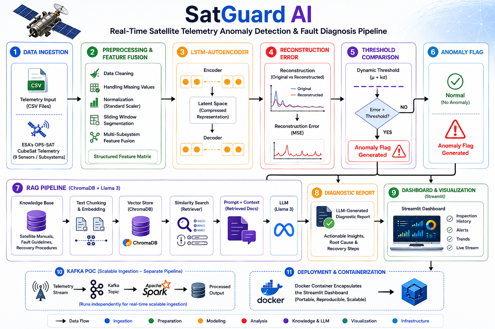
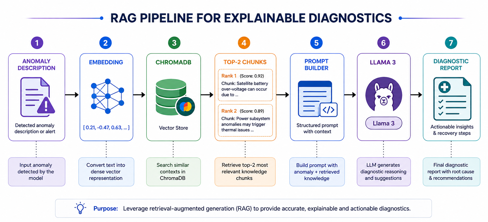
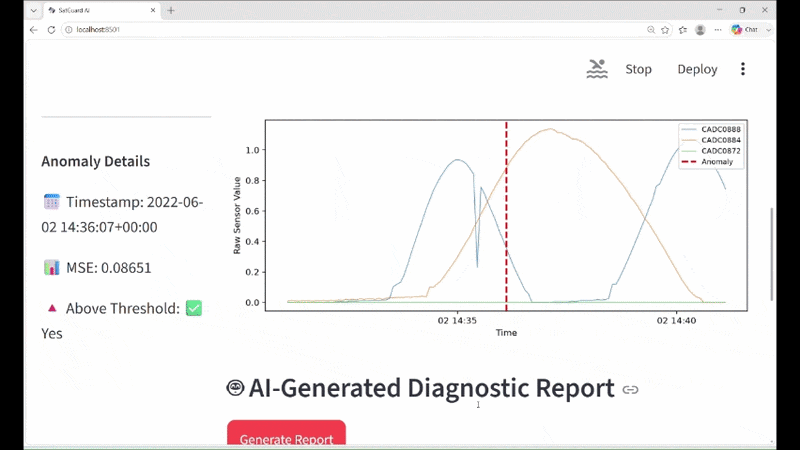

markdown
# 🛰️ SatGuard AI

**Real‑Time Satellite Telemetry Anomaly Detection Pipeline with Deep Learning, Multi‑Subsystem Feature Fusion, and LLM‑Generated Fault Diagnostic Reports**


---

## 📌 Table of Contents

- [Overview](#overview)
- [Key Features](#key-features)
- [System Architecture](#system-architecture)
- [Demo](#demo)
- [Evaluation](#evaluation)
- [Tech Stack](#tech-stack)
- [Repository Structure](#repository-structure)
- [Setup & Installation](#setup--installation)
- [Docker Deployment](#docker-deployment)
- [Kafka Streaming Proof‑of‑Concept](#kafka-streaming-proof‑of‑concept)
- [Documentation & Resources](#documentation--resources)
- [Limitations & Future Work](#limitations--future-work)
- [License](#license)
- [Contact](#contact)

---

## 🧭 Overview

SatGuard AI monitors spacecraft health using real ESA OPS‑SAT CubeSat telemetry (300K+ records, 9 sensor channels). It detects anomalies with an LSTM‑Autoencoder and generates plain‑English diagnostic reports using a local RAG pipeline + Llama 3, all offline on a laptop.

## ✨ Key Features

- Real, messy satellite telemetry
- Multi‑subsystem feature fusion (45 features)
- Deep learning anomaly detection (LSTM‑Autoencoder)
- Explainable diagnostics (RAG + ChromaDB + Llama 3)
- Fully offline LLM
- Interactive Streamlit dashboard
- Docker containerization
- Kafka streaming proof‑of‑concept

## 🧠 System Architecture



Detailed RAG flow:



## 🎬 Demo

### Quick GIF


### Full Walkthrough (YouTube)
[Watch the full walkthrough](https://youtu.be/mchuxfH_WaY)

## 📊 Evaluation

| Metric | Value |
|--------|-------|
| Precision | 1.000 |
| Recall | 0.024 |
| F1‑score | 0.046 |

*High‑precision, low‑recall baseline. Zero false alarms. Recall improvement planned.*

## 🛠️ Tech Stack

- Python, Pandas, NumPy, TensorFlow/Keras, Scikit‑learn
- Streamlit, ChromaDB, LangChain, Ollama, Llama 3
- Docker, Apache Kafka, Git/GitHub

## 📁 Repository Structure

```text
SatGuard-AI/
├── app.py
├── satguard_eda.ipynb
├── lstm_autoencoder.ipynb
├── rag_llm_diagnostics.ipynb
├── streaming_simulation.ipynb
├── kafka_streaming_demo.py
├── docker-compose.yml
├── Dockerfile
├── requirements.txt
├── threshold.json
├── evaluation_metrics.json
├── rag_evaluation_results.json
├── ts_cleaned.csv
├── anomaly_flags.csv
├── lstm_autoencoder.keras
├── chroma_db/
├── knowledge_base/
├── images/
├── docs/
└── demo/
🚀 Setup & Installation
Clone the repository:

bash
git clone https://github.com/marshenilmitra/SatGuard-AI.git
cd SatGuard-AI
Create Python 3.11 virtual environment and install dependencies:

bash
python -m venv venv
source venv/bin/activate    # Linux/Mac
venv\Scripts\activate       # Windows
pip install -r requirements.txt
Install Ollama and pull Llama 3:

bash
ollama pull llama3:8b
Run the dashboard:

bash
streamlit run app.py
🐳 Docker Deployment
bash
docker build -t satguard .
docker run -p 8501:8501 \
  -v ${PWD}/ts_cleaned.csv:/app/ts_cleaned.csv \
  -v ${PWD}/lstm_autoencoder.keras:/app/lstm_autoencoder.keras \
  -v ${PWD}/chroma_db:/app/chroma_db \
  -v ${PWD}/threshold.json:/app/threshold.json \
  -v ${PWD}/anomaly_flags.csv:/app/anomaly_flags.csv \
  -v ${PWD}/evaluation_metrics.json:/app/evaluation_metrics.json \
  satguard
⚡ Kafka Streaming Proof‑of‑Concept
bash
docker compose up -d          # Start Kafka + Zookeeper
python kafka_streaming_demo.py # Run producer/consumer
docker compose down           # Stop Kafka
📚 Documentation & Resources
Project Report PDF
- [Project Report PDF](docs/SatGuard_AI_Project_Report.pdf)
Presentation PDF
- [Presentation PDF](docs/SatGuard_AI_Presentation.pdf)

🔮 Limitations & Future Work
Improve recall via threshold tuning and refined labelling

Integrate Kafka directly into dashboard for true real‑time

Expand knowledge base

Add advanced RAG evaluation

Feature‑level explainability (SHAP)

📝 License
This project is licensed under the MIT License – see the [LICENSE](LICENSE) file.

👤 Contact
Marshenil Mitra
Bachelor of Engineering (Information Technology), BVCOEW, Pune
Post Graduate Certificate Program (Big Data Analytics), CDAC, Chennai

https://img.shields.io/badge/GitHub-marshenilmitra-blue?logo=github
https://img.shields.io/badge/LinkedIn-marshenilmitra-0A66C2?logo=linkedin&logoColor=white
